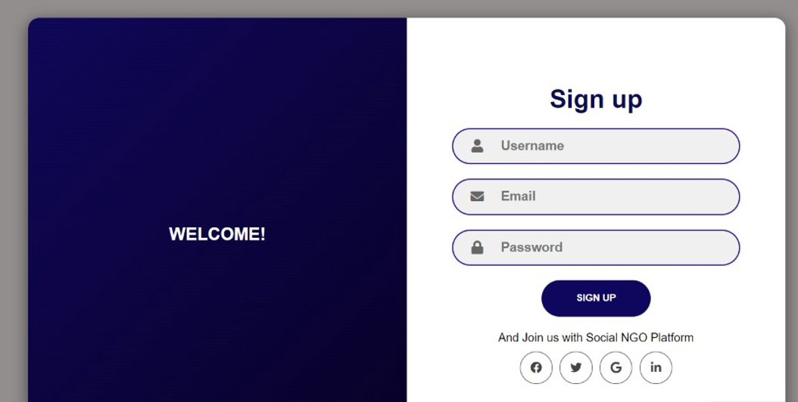
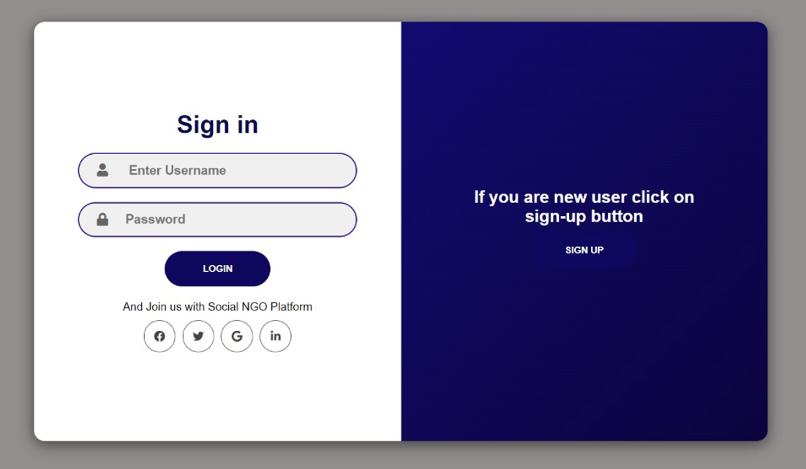
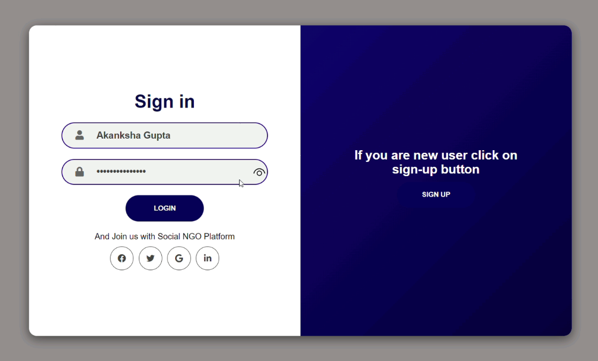

# We-Byte

<h2>Objective :</h2>

TO BUILD AN APPLICATION TO TRACK ATTENDANCE OF STUDENTS AND VOLUNTEERS ATTENDING CLASSES AT MULTIPLE LOCATIONS OF NGO.

<h2>About the Project :</h2>

In this Project, we had decided to call upon to create a web portal for this application. This application can be presented either as a website or an android app. 
<h3>The proposed App will function as follows:</h3>
<ul>
  <li>To add entry of a new student or volunteer</li>
  <li>To generate digital-ID’s with a scannable QR</li>
  <li>Can scan the card to track attendance</li>
  <li>To allow mentors to receive feedbacks from each student</li>
  <li>The ADMIN can see all participant’s detail on a single dashboard</li>
 </ul>

# Working:

<h2>LOGIN & SIGN-UP PAGE</h2>

<h2>HOME PAGE & FEATURES</h2>

 
<b>NOTE:- Our website which will provide link to download the extension, is still in progress. We'll keep updating to the contents of this Repository, and thank you for your time.</b>

